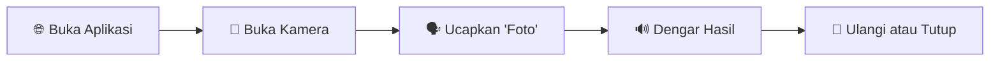

<div align="center">
  <h1>💰 MoneyTalks</h1>
  <p><strong>Aplikasi Web Pengenalan Uang untuk Tunanetra</strong></p>
  
  <p>
    
    
    
    
  </p>
  
  <p>
    
    
    
  </p>
</div>

---

## 📋 Deskripsi

**MoneyTalks** adalah aplikasi web revolusioner yang memanfaatkan teknologi _**image classification**_ (pengenalan gambar) dan _**text-to-speech**_ (TTS) untuk membantu penyandang tunanetra mengenali nominal uang secara mandiri.

Proyek ini dirancang khusus untuk menjadi solusi yang mudah diakses dan digunakan melalui kamera ponsel dan browser, dengan umpan balik suara sebagai panduan pengguna yang intuitif.

## 🎯 Tujuan Proyek

<table>
<tr>
<td align="center">🎯<br><strong>Mandiri</strong><br>Mengenali nominal uang kertas secara mandiri</td>
<td align="center">🎤<br><strong>Intuitif</strong><br>Menggunakan teknologi suara dan kamera</td>
<td align="center">🌐<br><strong>Aksesibel</strong><br>Dapat diakses melalui browser tanpa instalasi</td>
</tr>
</table>

## ✨ Fitur Utama

<div align="center">

|              🎯 **Deteksi Real-time**               |               🎤 **Voice Command**                |          🔊 **Audio Feedback**          |               📱 **Mobile Ready**               |
| :-------------------------------------------------: | :-----------------------------------------------: | :-------------------------------------: | :---------------------------------------------: |
| Deteksi nominal uang melalui kamera secara langsung | Navigasi dan interaksi menggunakan perintah suara | Umpan balik suara melalui teknologi TTS | Antarmuka ramah disabilitas di perangkat mobile |

</div>

## 🚀 Cara Menggunakan

### 🎮 Langkah-langkah Sederhana



<details>
<summary><strong>📋 Panduan Detail</strong></summary>

### 1️⃣ Membuka Halaman Deteksi Uang

Setelah membuka aplikasi, Anda bisa langsung mengakses halaman deteksi dengan menekan tombol atau menggunakan perintah suara.

### 2️⃣ Memulai dan Menghentikan Deteksi

- **🎥 Mengaktifkan kamera:** Ucapkan: _**"Buka Kamera"**_
- **📸 Mengambil gambar:** Ucapkan: _**"Foto"**_ untuk mendeteksi nominal uang. Sistem akan memberikan umpan balik suara dengan nominal uang yang dikenali.
  > ⚠️ **Note:** Jika gambar yang diambil bukan uang, sistem tetap memberikan deteksi gambar tetapi tanpa umpan balik suara.
- **❌ Menutup kamera:** Ucapkan: _**"Tutup Kamera"**_ untuk menghentikan proses deteksi.

</details>

## 🛠️ Tech Stack

<div align="center">

|                                                   **Frontend**                                                    |                                                      **AI/ML**                                                      |                                                       **Audio**                                                       |                                                  **Camera**                                                  |
| :---------------------------------------------------------------------------------------------------------------: | :-----------------------------------------------------------------------------------------------------------------: | :-------------------------------------------------------------------------------------------------------------------: | :----------------------------------------------------------------------------------------------------------: |
|                 |  |             |         |
|                    |          |  |  |
|  |                                                                                                                     |                                                                                                                       |                                                                                                              |

</div>

## 🚀 Instalasi & Pengembangan

### 📋 Prasyarat

- ✅ **Node.js** (versi 16+ recommended)
- ✅ **npm** atau **yarn**
- ✅ **Browser modern** dengan dukungan WebRTC

### ⚡ Quick Start

```bash
# 1. Clone repository
git clone https://github.com/ludgerdusl/moneytalks.git

# 2. Masuk ke direktori
cd moneytalks

# 3. Install dependencies
npm install

# 4. Jalankan aplikasi
npm run dev
```

<div align="center">
  
</div>

---

## 🤝 Kontribusi

<div align="center">

**Kami sangat menghargai kontribusi Anda!** 🌟

[](https://github.com/ludgerdusl/moneytalks/graphs/contributors)

</div>

### 🔥 Cara Berkontribusi:

- 🐛 **Bug Reports:** Laporkan bug melalui [Issues](https://github.com/ludgerdusl/moneytalks/issues)
- ✨ **Feature Requests:** Ajukan fitur baru
- 🔧 **Pull Requests:** Submit code improvements
- 📖 **Documentation:** Bantu perbaiki dokumentasi

---

## 📜 Lisensi

<div align="center">
  
[](https://opensource.org/licenses/MIT)

**Proyek ini dilisensikan di bawah [MIT License](LICENSE)**

</div>

---

## 📧 Kontak & Support

<div align="center">

### 💬 Mari Terhubung!

[](mailto:ludgerdusl@gmail.com)
[](https://github.com/ludgerdusl)

</div>

---

<div align="center">
  <h3>🌟 Jika proyek ini membantu, jangan lupa beri ⭐ Star! 🌟</h3>
  <p><em>Dibuat dengan ❤️ untuk aksesibilitas yang lebih baik</em></p>
</div>
